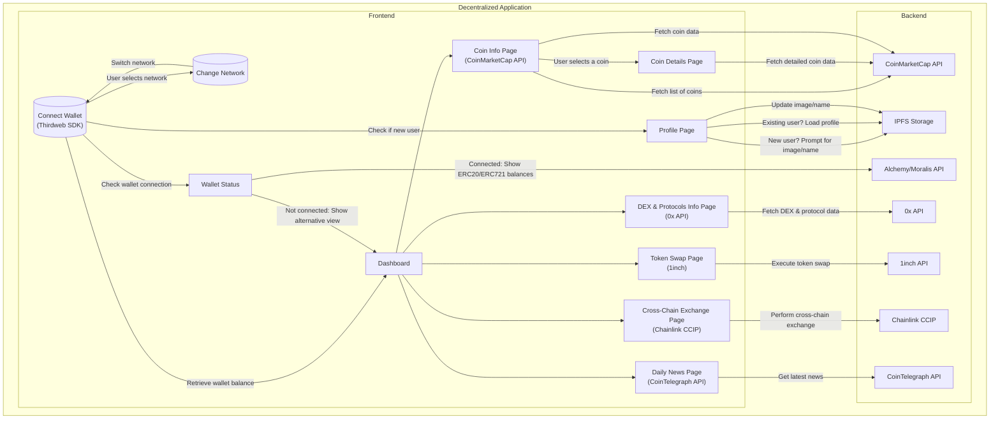

## Intro

This documentation will serve as a guide to understanding the flow and interactions within the DApp, focusing on its frontend and backend components, as well as the external APIs it integrates with.

  
Dapp Archietcture diagram source

To document the provided Mermaid code, which represents the architecture of a Decentralized Application (DApp) named "PortRadar", we'll break down the components and interactions within the system.

## Decentralized Application (DApp) Architecture Overview

The DApp, named "PortRadar", is designed to provide a comprehensive platform for managing and tracking cryptocurrency and NFT holdings. The architecture is divided into two main sections: the Frontend and the Backend. The Frontend is responsible for the user interface and interactions, while the Backend handles data management and external API integrations.

### Frontend Components

The Frontend of the DApp is composed of several key components, each serving a specific purpose:

- WalletConnect: Allows users to connect their wallets using the Thirdweb SDK. This is the entry point for users to interact with the DApp.
- NetworkChange: Enables users to switch between different blockchain networks.
- Dashboard: The main interface where users can view their portfolio and access various features.
- CoinInfo: Displays information about different cryptocurrencies, utilizing the CoinMarketCap API.
- CoinDetails: Provides detailed information about a selected cryptocurrency.
- DexInfo: Offers insights into decentralized exchanges (DEX) and protocols, leveraging the 0x API.
- SwapTokens: Facilitates token swaps, utilizing the 1inch API.
- CrossChainExchange: Allows for cross-chain exchanges, leveraging the Chainlink CCIP.
- NewsPage: Presents the latest news related to cryptocurrencies, using the CoinTelegraph API.
- ProfilePage: Manages user profiles, including image and name updates, with data stored on IPFS.
- WalletStatus: Monitors the connection status of the user's wallet and displays relevant information

### Backend Components

The Backend of the DApp is responsible for managing data and integrating with external APIs:

- CoinMarketCap API: Provides data on cryptocurrencies.
- 0x API: Offers information on decentralized exchanges and protocols.
- 1inch API: Facilitates token swaps.
- Chainlink CCIP: Enables cross-chain exchanges.
- CoinTelegraph API: Delivers the latest news on cryptocurrencies.
- IPFS Storage: Stores user profile data.
- Alchemy/Moralis API: Manages wallet connections and retrieves ERC20/ERC721 balances.

### Interactions and Flow

The DApp follows a specific flow of interactions between its components and external APIs:

- Wallet Connection: Users connect their wallets using WalletConnect. This triggers the retrieval of the wallet balance and checks if the user is new or existing.
- Network Selection: Users can change the blockchain network through NetworkChange.
- Profile Management: New users are prompted to provide an image and name, while existing users can update their profile information.
- Wallet Status Check: The DApp checks the wallet connection status and displays either the ERC20/ERC721 balances or an alternative view.
- Dashboard Access: Users can access various features from the Dashboard, including viewing coin information, swapping tokens, accessing DEX information, and more.
- Data Fetching: The DApp fetches data from external APIs to display information on coins, DEXs, token swaps, cross-chain exchanges, and news.

This documentation provides a overly simplified and structured overview of the "PortRadar" DApp's architecture, detailing its components, interactions, and the external APIs it integrates with. Understanding this architecture is crucial for developers and users alike, as it lays the foundation for the DApp's functionality and user experience.
